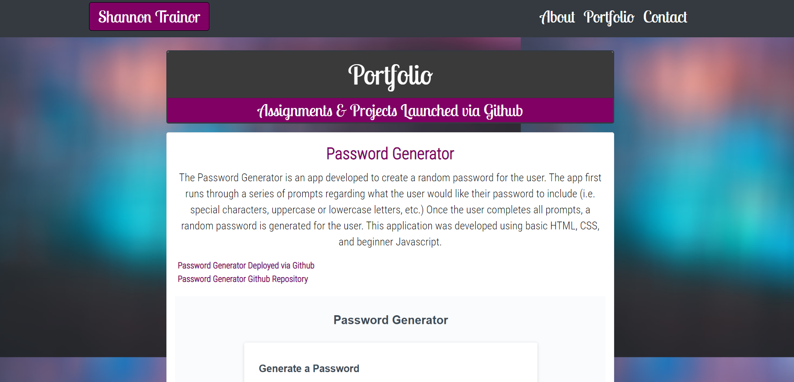

### Updated Portfolio

## Description
Responsive Portfolio from week 2 has been updated to include examples of recent projects and homeworks. Descriptions, screenshots, GitHub links, and depolyed links have been provided for each project. A contact page with personal contact information has also been updated.

## Usage
The first update of my portfolio contains information useful to demostrate skills learned for future job potential as well as for potential employers to view.
Below is a screenshot of the updated Portfolio Page:

## Deploy
My updated portfolio is deployed here:
https://shannontrainor.github.io/updated-portfolio-1/

### Credits
Bootstrap https://getbootstrap.com/  
Google Fonts https://fonts.google.com/  
Unsplash https://unsplash.com/  
GitHub https://github.com/
